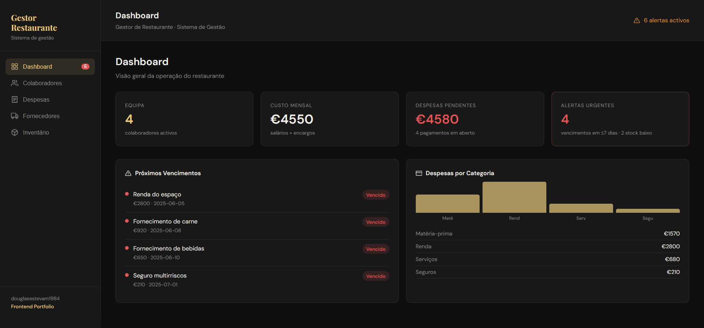

# 🍽️ Restaurant Manager

A web-based management system for restaurants — built in React to solve real operational problems.

---

## 🚀 Live Demo

🔗 **[View Live Project](https://douglasestevam1984.github.io/gestor-restaurante)**



---

## 💡 Background

This project was born from a real problem: managing a restaurant group with no centralized tool to track staff, expenses, suppliers, and inventory.

The app consolidates the entire operation into a single dashboard — designed to be simple, fast, and practical for daily use.

---

## 🧠 Features

### 📊 Dashboard

- Real-time KPIs: team size, monthly cost, pending expenses, and active alerts
- Automatic alerts for upcoming due dates (≤7 days)
- Expenses breakdown chart by category
- Live alert badge on sidebar navigation

### 👥 Staff

- Full records: name, role, salary, hire date, and vacation schedule
- Automatic monthly payroll cost calculation
- Upcoming vacation alerts
- Full CRUD with modal form

### 💸 Expenses

- Records with category, supplier, and due date
- Filter by status: all / pending / paid
- Mark as paid with a single click
- Color-coded urgency: overdue / ≤3 days / ≤7 days

### 🏢 Suppliers

- Centralized partner database
- Organized by category
- Full CRUD

### 📦 Inventory _(key differentiator)_

- Stock tracking per product and unit
- Configurable minimum stock with automatic alerts
- Visual stock level bar per product
- Origin tracking (Central Hub / Restaurant branch)

---

## 🛠️ Tech Stack

| Technology   | Usage                                 |
| ------------ | ------------------------------------- |
| React 18     | UI and state management               |
| Vite         | Build tool and dev server             |
| Context API  | Shared global state                   |
| LocalStorage | In-browser data persistence           |
| Custom CSS   | Styling with no external dependencies |

---

## 🏗️ Architecture

```
src/
└── App.jsx
    ├── AppContext     # Global state (Context API)
    ├── useStorage     # Persistence hook (LocalStorage)
    ├── Dashboard      # Overview page
    ├── Staff          # Team CRUD
    ├── Expenses       # Financial CRUD
    ├── Suppliers      # Partners CRUD
    └── Inventory      # Stock control
```

Global state is managed via Context API with automatic LocalStorage persistence. Seed data loads on first visit so the app is immediately demonstrable without any setup.

---

## 💻 Running Locally

```bash
git clone https://github.com/douglasestevam1984/gestor-restaurante.git
cd gestor-restaurante
npm install
npm run dev
```

Open `http://localhost:5173` — demo data loads automatically.

---

## 📌 Roadmap

- [ ] Split components into individual files
- [ ] Add React Router for URL-based navigation
- [ ] Stock transfer module between restaurant branches
- [ ] Backend integration (Node.js / Supabase)
- [ ] User authentication
- [ ] PDF report export

---

## 🙋‍♂️ About

Civil engineer transitioning into Frontend Development, with 13+ years of experience in project management and team leadership.

This project combines hands-on restaurant management experience with software development — the problem I'm solving is one I know from the inside.

📎 [LinkedIn](https://www.linkedin.com/in/douglasestevamdev) · 📂 [Portfolio](https://douglasestevam1984.github.io)
