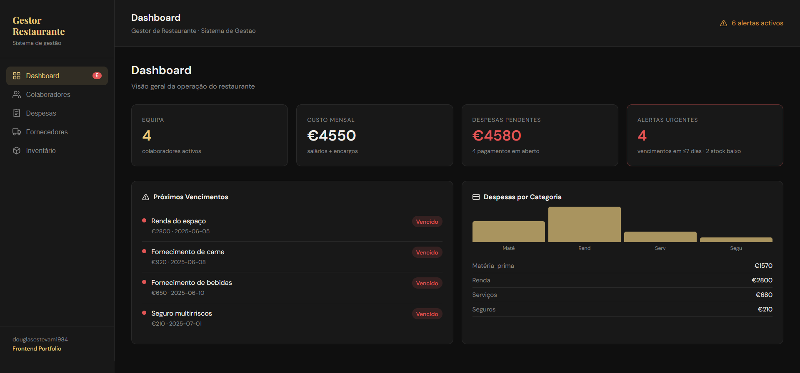

# 🍽️ Gestor de Restaurante

A web app for managing the day-to-day operations of a restaurant — staff,
expenses, suppliers and inventory — centralized in a single dashboard.

🔗 **Live demo:** https://douglasestevam1984.github.io/gestor-restaurante



---

## About

Built to solve a real problem: restaurant owners struggle to keep track of
their team, expenses and important deadlines. The app centralizes that
information in one simple, visual interface with priority alerts.

---

## Features

- **Staff (Colaboradores)** — manage employees, salaries, hire and vacation
  dates, with automatic monthly payroll cost
- **Expenses (Despesas)** — register expenses, link them to suppliers, track
  due dates and mark as paid, with visual deadline alerts
- **Suppliers (Fornecedores)** — central directory of partners organized by
  category
- **Inventory (Inventário)** — stock levels with minimum thresholds and
  low-stock warnings
- **Dashboard** — overview of headcount, payroll cost, pending expenses and
  priority alerts

---

## Tech stack

- **React 19**
- **Vite** (build tool / dev server)
- **Context API** for global state
- **localStorage** for data persistence
- Plain CSS (custom properties / design tokens)

---

## Project structure

```
src/
├── App.jsx              # layout: sidebar, topbar, page routing
├── main.jsx             # entry point + providers
├── index.css           # global styles and design tokens
├── constants.js        # shared constants
├── data/
│   └── seed.js          # initial demo data
├── utils/
│   └── format.js        # formatting helpers (currency, dates)
├── context/
│   ├── AppContext.js    # the Context object
│   └── AppProvider.jsx  # provider + localStorage state
├── hooks/
│   └── useApp.js        # hook to consume global state
├── components/
│   ├── Icon.jsx         # inline SVG icon set
│   └── Modal.jsx        # reusable modal
└── pages/
    ├── Dashboard.jsx
    ├── Colaboradores.jsx
    ├── Despesas.jsx
    ├── Fornecedores.jsx
    └── Inventario.jsx
```

---

## Running locally

```bash
npm install
npm run dev      # start the dev server
npm run build    # production build
npm run lint     # run ESLint
```

---

## Roadmap

- Backend integration (Node.js / Firebase)
- User authentication
- Email notifications
- Further mobile optimization

---

## About me

Civil engineer transitioning into frontend development. This project is part
of my portfolio, focused on solving real problems with simple, effective
solutions.

**LinkedIn:** https://www.linkedin.com/in/douglasestevamdev